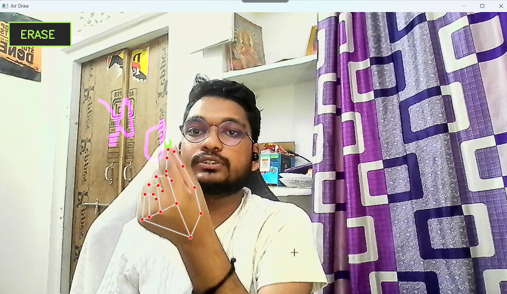

# 🎨 Air Draw — Real-Time Mid-Air Canvas

<div align="center">

<!-- Animated typing header -->


<p align="center">
  <strong>Draw, write, and create in mid-air using your webcam! Air Draw is a real-time computer vision application that detects hand landmarks to paint on your screen using dynamic hand gestures.</strong>
</p>

<!-- Tech Stack Badges -->
<p align="center">
  
  
  
  
  
</p>

<!-- GitHub Stats Badges -->
<p align="center">
  
  
  
</p>

---
</div>

## 🌟 Key Features

*   **✨ Interactive Gestures**: Pinch your index finger and thumb together to draw. Open them up to stop painting and navigate the screen.
*   **🩺 Real-Time Hand Landmark Tracking**: Utilizes **MediaPipe Hands** to map 21 joint coordinates with high precision.
*   **🧼 Interactive In-Screen Buttons**: Hover over the virtual **ERASE** button drawn on the screen overlay to clear the canvas instantly.
*   **💨 Cursor Smoothing & Jitter Control**: Implements exponential moving average (EMA) to ensure butter-smooth brush strokes.
*   **🛡️ Glitch & Jump Filtering**: Automatically rejects sudden tracking glitches or hand jumps (via Euclidean distance thresholds).
*   **🎨 Dynamic Cursor States**: Active feedback cursor changes color (Green/Gray) to let you know if you are in drawing or moving mode.

---

## 🎮 How It Works (Controls)

| Gesture / Key | Action | Visual Feedback |
| :--- | :--- | :--- |
| **Pinch Finger + Thumb** | Activate Drawing Mode | Cursor turns <kbd>Teal/Green</kbd> & begins drawing lines |
| **Open Hand / Separate Fingers** | Activate Hover Mode | Cursor turns <kbd>Gray</kbd> & lets you move freely |
| **Hover over "ERASE" Box** | Reset & Clear Canvas | Bounding box is at top-left screen corner |
| **Press <kbd>C</kbd> Key** | Clear Canvas | Immediately wipes all strokes |
| **Press <kbd>Q</kbd> Key** | Quit Application | Safely closes webcam and windows |

---

## 📐 Technical Deep-Dive

Air Draw dynamically scales gesture thresholds based on how close your hand is to the camera.

### 1. Dynamic Pinch Detection
Rather than relying on static pixel distances, the distance between the **Index Finger Tip** (Landmark 8) and **Thumb Tip** (Landmark 4) is normalized against the **Hand Size** (distance between the **Wrist** [Landmark 0] and the **Middle Finger MCP** [Landmark 9]):

$$\text{Pinch Distance} = \sqrt{(x_{\text{index}} - x_{\text{thumb}})^2 + (y_{\text{index}} - y_{\text{thumb}})^2}$$

$$\text{Hand Size} = \sqrt{(x_{\text{middle}} - x_{\text{wrist}})^2 + (y_{\text{middle}} - y_{\text{wrist}})^2}$$

$$\text{Draw Mode} = \text{Pinch Distance} < \text{Hand Size} \times 0.55$$

### 2. Cursor Smoothing Formula
We smooth hand tremors using an exponential filter:

$$x_{\text{smooth}} = x_{\text{prev}} + (x_{\text{current}} - x_{\text{prev}}) \times 0.45$$
$$y_{\text{smooth}} = y_{\text{prev}} + (y_{\text{current}} - y_{\text{prev}}) \times 0.45$$

---

## 🚀 Getting Started

### 📋 Prerequisites
Ensure you have **Python 3.12+** installed on your system.

### ⚙️ Installation & Running

1. **Clone the repository:**
   ```bash
   git clone https://github.com/pawan941394/Air-Draw-Real-Time-Mid-Air-Canvas.git
   cd Air-Draw-Real-Time-Mid-Air-Canvas
   ```

2. **Run using `uv` (Recommended - Lightning Fast):**
   If you have the `uv` tool installed, simply run:
   ```bash
   uv run computervisioncode.py
   ```

3. **Or run using standard `pip`:**
   ```bash
   pip install opencv-python mediapipe numpy
   python computervisioncode.py
   ```

---

## ⚡ Demo & Visuals

<div align="center">
  
</div>

---

## 🌐 Connect & Integrate (Socials)

If you like this project, feel free to connect with me!

<div align="center">

[](https://github.com/pawan941394/)
[](https://www.linkedin.com/in/pawan941394/)
[](https://www.youtube.com/@Pawankumar-py4tk)

</div>

---

## 🤝 Contributing

Contributions make the open-source community an amazing place to learn, inspire, and create.
1. Fork the Project
2. Create your Feature Branch (`git checkout -b feature/AmazingFeature`)
3. Commit your Changes (`git commit -m 'Add some AmazingFeature'`)
4. Push to the Branch (`git push origin feature/AmazingFeature`)
5. Open a Pull Request

---

## 📄 License
Distributed under the MIT License. See `LICENSE` for more information.

<div align="center">
  Developed with ❤️ by <a href="https://github.com/pawan941394">Pawan Kumar</a>
</div>
